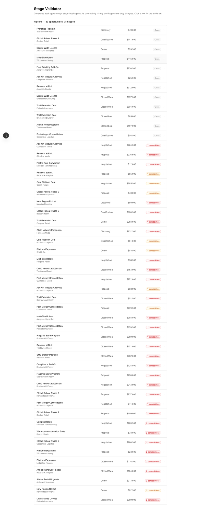
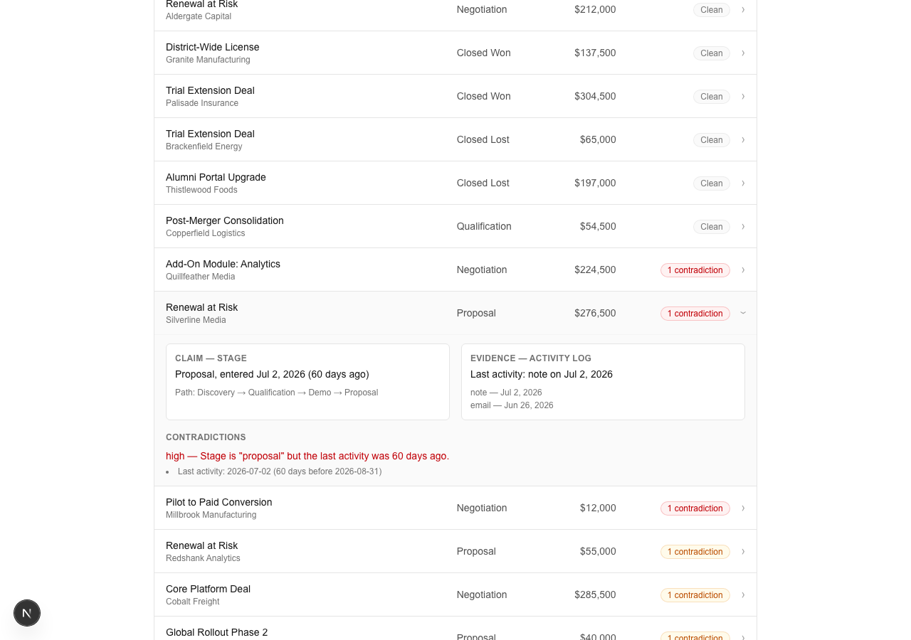

# Stage Validator

Compares each opportunity's stage label against its own activity history and
flags where they disagree.

[Live Demo](https://stage-validator.vercel.app) · Day 030 of a 100-day building challenge.

## Why I Built This

A CRM's stage field is a claim, not a fact — nothing forces it to agree with
what the activity log actually shows. A deal can sit in "Negotiation" for
weeks after the last real touch, a rep can send a contract without ever
moving the stage field forward, or a deal can reach "Closed Won" with no
activity that looks like a close. Nobody catches these by reading a stage
column; they only show up by checking the stage against the deal's own
history, which is exactly what this tool automates.

## What It Does

50 synthetic opportunities, each evaluated against 5 deterministic rules that
compare the claimed stage to the activity log: stalled-but-advanced-stage,
activity-ahead-of-label, stage-skipped, closed-won-without-evidence, and
single-touch-late-stage. Every fired rule carries a severity (high/medium)
and the specific evidence — dates, activity types — that triggered it.
Clicking an opportunity expands a claim-vs-evidence panel: what the stage
says, next to what the activity log actually shows.

## Demo

**Pipeline list** — every opportunity with a contradiction badge, colored by
highest severity:



**Claim vs evidence**, expanded on click — a stalled deal caught by
`stalled-but-advanced-stage`:



## How It Works

```
lib/types.ts              Stage, Activity, Opportunity, Flag — the domain model
lib/rules.ts               5 pure rule functions + evaluateOpportunity()
lib/generate-corpus.ts     one-off seeded generator (not run at runtime)
data/opportunities.ts      the generated corpus, committed
app/page.tsx                → app/components/OpportunityRow.tsx
                               → app/components/SeverityBadge.tsx
                               → app/components/ContradictionPanel.tsx
```

Each rule is a pure function — `(Opportunity, asOfDate?) => Flag | null` —
over an opportunity's `stageHistory` (the path it actually took through the
funnel) and `activities` (its dated activity log). `evaluateOpportunity` runs
all 5 and returns the fired flags. The corpus is evaluated against a fixed
anchor date, not `Date.now()`, so the deployed demo's flags never silently
change as real time passes.

## Key Decisions & Tradeoffs

- **Decision:** A governance/consistency checker, not a risk scorer.
  **Why:** [Pipeline Inspector](https://github.com/akshatiwarix/pipeline-inspector)
  (Day 022) already owns "is this deal stalled or risky" — a predictive
  judgment. This repo only checks whether a stage label is internally
  consistent with the activity that produced it, and reuses that repo's
  proven shape (deterministic rules, evidence, severity) for a different
  domain, framed around a claim-vs-evidence comparison instead of a ranked
  score.
  **Tradeoff:** No single "health score" per opportunity — a deal either has
  contradictions or it doesn't, each independently evidenced.

- **Decision:** Synthetic corpus built by category (12 clean, each rule
  independently represented, 9 deliberate multi-flag combinations),
  seeded for reproducible cosmetic detail, rather than randomly generated
  and hoped to hit coverage.
  **Why:** Guarantees every rule has real, inspectable examples instead of
  relying on chance — checked by `lib/corpus.test.ts` on every run.
  **Tradeoff:** The corpus is authored, not organic; it demonstrates the
  rules rather than reflecting any real pipeline's actual distribution.

- **Decision:** `stageHistory` (the ordered path an opportunity took) instead
  of tagging every activity with the stage it happened in.
  **Why:** Makes stage-skipped detection a simple set comparison against the
  canonical funnel order, without needing per-activity stage metadata.
  **Tradeoff:** Can't detect "activity happened during a stage that was later
  skipped from the visible history" — only whether a stage was ever entered.

## Getting Started

### Prerequisites

- Node.js 20+
- npm

### Installation

```bash
git clone https://github.com/akshatiwarix/stage-validator.git
cd stage-validator
npm install
```

### Run Locally

```bash
npm run dev
```

Open [http://localhost:3000](http://localhost:3000).

## Validation / Testing

```bash
npm test
```

- `lib/rules.test.ts` — per-rule unit tests: fires on the exact triggering
  condition, doesn't fire just under threshold, correct severity at the
  boundary.
- `lib/corpus.test.ts` — sweeps the committed 50-opportunity corpus: exact
  count, unique ids, minimum clean count, minimum trigger count per rule, at
  least one multi-flag case.

The UI was manually verified in a live browser (local and the deployed
production URL): all 50 rows render with correct badges, expand/collapse
works, both a clean and a flagged opportunity's detail panel read correctly,
no console errors.

## Limitations

- Demo data only — not connected to a real CRM.
- Fixed severity thresholds (30/45-day stall windows) — not configurable in
  the UI.
- No interactive "paste your own opportunity" tester.

## What I'd Build Next

- Interactive tester: paste or edit an opportunity, see the rules evaluate
  live.
- Configurable thresholds exposed as UI controls instead of fixed constants.
- CSV import for a user's own opportunity export.

## License

MIT — see [LICENSE](LICENSE).
